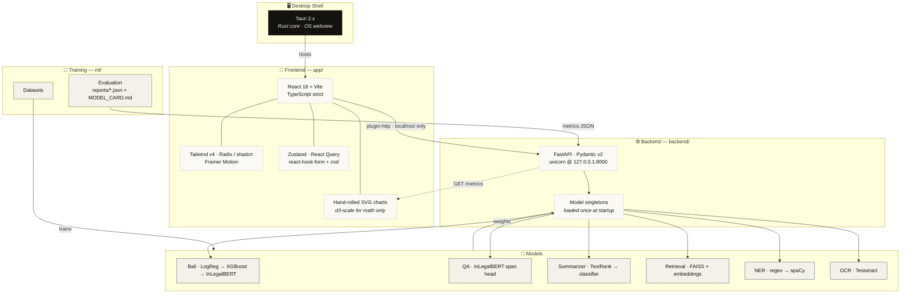
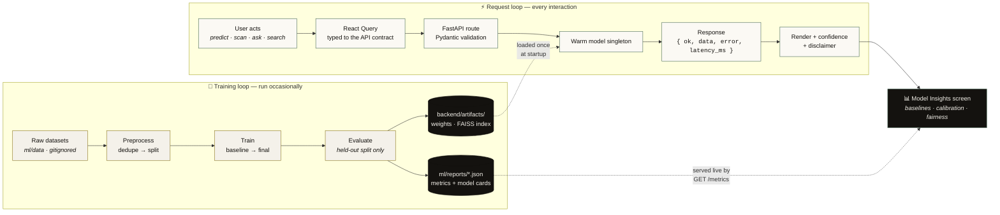

<div align="center">

# NyayaSetu

**न्यायसेतु** · *a bridge to justice*

An offline-first desktop suite for the Indian judicial domain, backed by five independently trained machine-learning models — and a screen that shows you exactly how well each one actually works.

[](plan.md)
[](LICENSE)
[](https://tauri.app)
[](https://react.dev)
[](https://www.typescriptlang.org)
[](https://tailwindcss.com)
[](https://fastapi.tiangolo.com)
[](https://python.org)
[](https://pytorch.org)
[](#privacy)
[](#why-no-llm)

</div>

> [!WARNING]
> **NyayaSetu does not provide legal advice.** It is an academic research project exploring machine learning on Indian legal text. Its outputs are statistical predictions with measurable error rates, not legal opinions. Do not rely on it for any real proceeding.

---

## What it does

| Module | Input | Output |
|---|---|---|
| ⚖️ **Bail Prediction** | Structured case facts | Predicted outcome + calibrated probability + SHAP factor attribution |
| 🧭 **Fairness Audit** | The bail model itself | Disparity gaps, before and after controlling for legitimate legal factors |
| 🔍 **Extractive QA** | A question + a judgment | The answer **highlighted in place** in the source text — never generated prose |
| 📄 **Document Scan** | A photo of a legal document | OCR → structured fields (case no., parties, IPC sections, dates) with per-field confidence |
| ✂️ **Summarization** | Full judgment text | Extractive summary, with the provenance of every selected sentence |
| 📚 **Precedent Search** | A natural-language query | Ranked past judgments with real similarity scores |
| 📊 **Model Insights** | — | Live evaluation metrics, baseline-vs-final comparisons, and calibration curves for all of the above |

**The Model Insights screen is the point.** Most ML demos hide their evaluation in a report nobody opens. Here it is a first-class screen, served live from the running backend — retrain a model, restart, and the app's numbers change with zero frontend edits.

---

## Stack



---

## Workflow

Two independent loops meet at one boundary. `ml/` only ever **writes**; `backend/` only ever **reads**. The API process never trains.



> The dotted lines are the whole architecture in one picture: **weights and metrics are the only things that cross from training into runtime.** Nothing is hardcoded, and nothing is trained inside the API.

---

## Design

Monochrome paper and ink, typewriter-styled — a judiciary aesthetic built from **Space Mono** (headings, and every machine-extracted identifier or measured number) and **Special Elite** (all prose and small text). The split is semantic: if it was extracted or measured by a model, it is set in mono, so you can always tell at a glance what the machine produced versus what a person wrote.

Floating cards over a grained paper canvas, a left rail that expands on hover and **pushes** content rather than covering it, rubber-stamp verdict badges, and a light/dark toggle whose transition wipes outward from the switch itself. Full token set and rules in [CLAUDE.md §5](CLAUDE.md).

### Screenshots

<!-- Added at the end of Phase 4. Startup · Home · Predict + Result · Scan · Search · Insights, in both themes. -->

*Coming with Phase 4.*

---

## Quickstart

**Prerequisites** — Node 18+, Rust (for Tauri), Python **3.11**, and [Tesseract OCR](https://github.com/UB-Mannheim/tesseract/wiki) (`winget install UB-Mannheim.TesseractOCR` on Windows).

```bash
git clone https://github.com/SriramWorkSpace/NyayaSetu.git
cd NyayaSetu
```

```bash
# terminal 1 — backend
cd backend
py -3.11 -m venv .venv && .venv/Scripts/activate    # macOS/Linux: source .venv/bin/activate
pip install -r requirements.txt
uvicorn app.main:app --reload --port 8000
```

```bash
# terminal 2 — desktop app
cd app
npm install
npm run tauri dev        # or `npm run dev` for browser-only iteration
```

Models load once at backend startup, so the first request is already warm by the time uvicorn prints *Application startup complete*.

---

## Datasets & licensing

| Dataset | License | Used for |
|---|---|---|
| [IndianBailJudgments-1200](https://huggingface.co/datasets/SnehaDeshmukh/IndianBailJudgments-1200) | **CC BY 4.0** | Bail prediction + fairness audit; its 1,200 source PDFs double as real test inputs for the scan module |
| [IL-TUR / ILDC / CJPE](https://huggingface.co/datasets/Exploration-Lab/IL-TUR) | **CC BY-NC** | Extractive QA gold spans (56-doc expert split) and the precedent-retrieval corpus |
| [InLegalBERT](https://huggingface.co/law-ai/InLegalBERT) | model weights | Shared backbone for bail, QA, NER, and domain embeddings |

> [!IMPORTANT]
> **IL-TUR is non-commercial.** While it is part of this project, NyayaSetu cannot be commercialized. See [decisions.md D-006](decisions.md).

---

## <a name="why-no-llm"></a>Why no generative AI?

Every predictive component here is **trained and evaluated in-house**. Bail prediction, QA, summarization, retrieval, and NER are real models with real, measured error rates — you can read every one of them on the Insights screen.

Exactly two touchpoints in the entire app call an external API, both purely cosmetic: rephrasing a search query, and turning a raw prediction into a readable sentence. **Neither affects any reported metric.**

This constraint is the project. Wrapping an LLM would produce answers that look better and mean nothing — there would be no baseline to beat, no calibration to check, and no honest way to say how often it is wrong. QA returns a **highlighted span inside the source judgment** rather than a chat bubble for exactly this reason: the interface should be honest about what the model actually does.

---

## <a name="privacy"></a>Privacy

Runs **entirely offline** after model download. No telemetry, no analytics, no crash reporting, no accounts. The backend binds to `127.0.0.1` only. Scanned documents are processed in memory and never persisted without an explicit save. Judgment text and case narratives are never written to logs. See [SECURITY.md](SECURITY.md).

---

## Project documents

| | |
|---|---|
| [ARCHITECTURE.md](ARCHITECTURE.md) | Full specification — scope, API contract, ML modules, quality floor |
| [plan.md](plan.md) | Phase-by-phase roadmap and current progress |
| [decisions.md](decisions.md) | Why things are the way they are |
| [CLAUDE.md](CLAUDE.md) | Working conventions — code style, design system, testing |
| [SECURITY.md](SECURITY.md) | Security policy, testing rulebook, and outcome log |

---

<div align="center">

**Sriram Madala** · B.Tech CSE, VIT

<sub>Not legal advice. An academic project.</sub>

</div>
